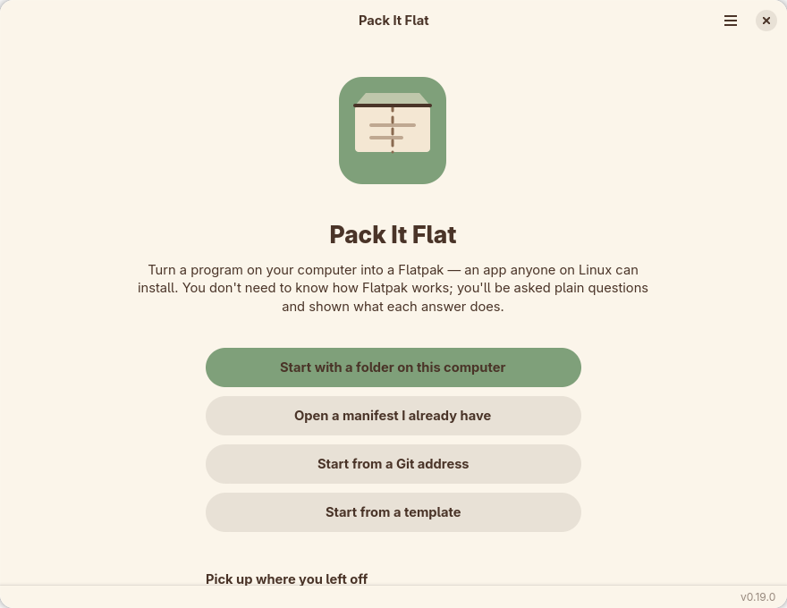
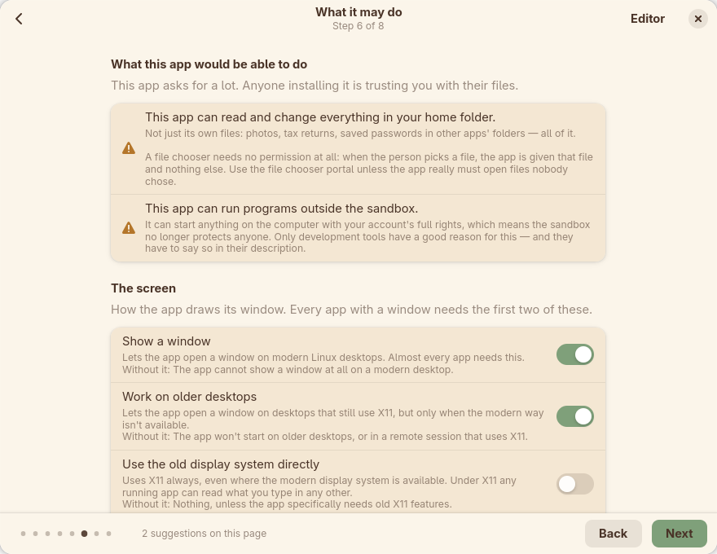
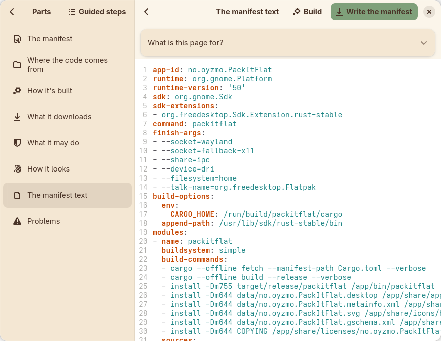
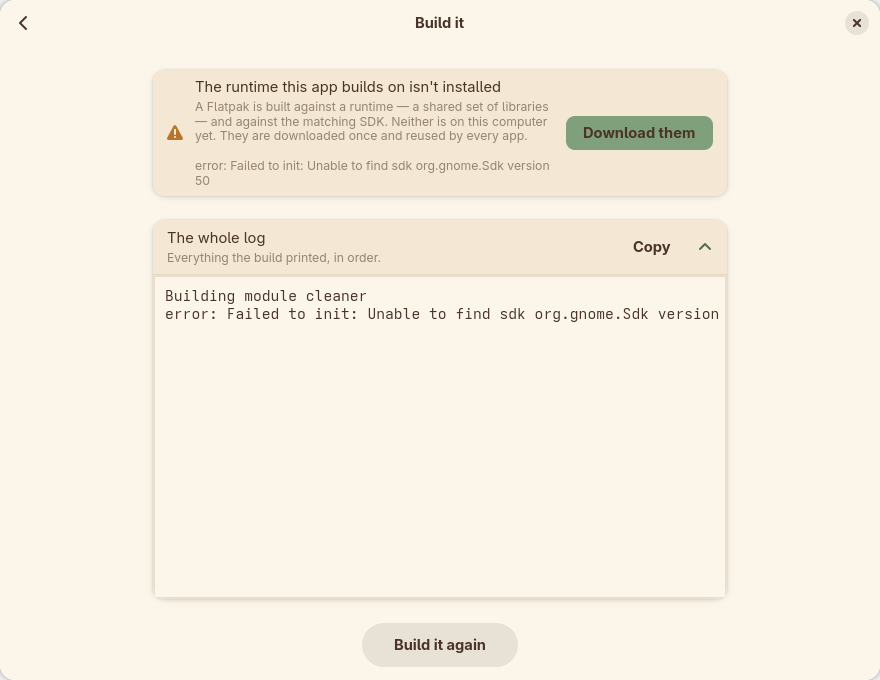

# Pack It Flat

**Make a Flatpak without knowing what a manifest is.**

Pack It Flat turns a program on your computer into a Flatpak — an app anyone on Linux can install.
It asks plain questions, explains what every answer does, and writes the manifest, the desktop
entry, the app information and the icon for you. It can run the build too, and when the build fails
it tells you what went wrong in a sentence instead of handing you a log.

It is a GNOME app, written in Rust with GTK4 and Libadwaita.



## What it does

- **Looks at your project folder** and works out how it is built — Cargo, Meson, CMake, autotools,
  a plain Makefile, Python, Node — and says *why* it thinks so.
- **Eight guided steps**, or an editor with every part on its own page. Both edit the same project,
  so you can switch at any point without losing what you typed. Everything is saved as you go.
- **No Flatpak jargon anywhere.** `finish-args` is "What it may do". Every field has a label, a
  plain sentence under it, a realistic example, and a "What is this page for?" you can open.
- **Permissions described as what the app could do to you**, worst first, with the safer
  alternative where there is one — not as a list of flags.
- **Writes the files**: the manifest, the `.desktop` entry, the AppStream metainfo and the icon,
  each in the right place with the right name. It shows you exactly what it will write, and what it
  would replace, before anything is written.
- **Prepares an offline build.** A Flatpak build has no network, so everything a Rust project
  downloads is transcribed from `Cargo.lock` into a list the build reads instead.
- **Runs the build** — only when you ask — with a live log, and translates the failures beginners
  actually hit into a sentence, a reason and, where possible, a button that fixes it.
- **Imports a manifest you already have**, in YAML or JSON, and tells you plainly about anything in
  it that it kept but cannot edit.
- **Starts from a Git address** if the code isn't on your computer yet, and pins the manifest to the
  commit it actually checked out.
- Works down to a 360px-wide window, so it is usable on a phone.

## Screenshots

| What the app may do | The manifest itself |
| --- | --- |
|  |  |

A failed build, explained:



## Installing

### From source

You need Rust 1.80 or newer and the GTK development libraries. On Fedora:

```sh
sudo dnf install gtk4-devel libadwaita-devel gtksourceview5-devel glib2-devel
cargo build --release
./target/release/packitflat
```

Debian and Ubuntu call them `libgtk-4-dev`, `libadwaita-1-dev`, `libgtksourceview-5-dev` and
`libglib2.0-dev`. Arch calls them `gtk4`, `libadwaita` and `gtksourceview5`.

Running from the source tree works without installing anything else: the app looks for its GSettings
schema first and keeps its preferences in a plain file under your config directory when the schema
isn't installed.

You can hand it a project on the command line:

```sh
packitflat ~/code/my-app              # a folder
packitflat ~/code/my-app/app.yml      # or a manifest to carry on editing
```

### As a Flatpak

```sh
./makeflatpak.sh
```

This builds the Flatpak and exports a single-file bundle into `dist/`. It installs nothing. You
need `flatpak-builder`, `python3` and `flatpak`, plus the GNOME 50 runtime, its SDK and the
rust-stable SDK extension — the script checks for each of them first and tells you the command to
install any that are missing.

The build has no network access, so the full list of crates the build downloads lives in the
repository as `generated-sources.json`. `flatpak/cargo-sources.py` regenerates it from `Cargo.lock`
using nothing but the Python standard library, and `makeflatpak.sh` does that for you whenever the
lock file is newer.

## What it deliberately doesn't do

- **No Flathub submission.** It makes the files; publishing is a separate decision with its own
  rules.
- **No arbitrary shell scripting UI.** Build commands are editable text, not a programming
  environment.
- **No other packaging formats.** Flatpak only.
- **Node and Python dependency lists are not generated.** Neither lock file carries what a Flatpak
  build needs, and producing a subtly wrong list would be worse than producing none — so the app
  hands you the exact command for the right tool and picks the file up once it exists.
- **Screenshots for the store listing are addresses, not uploads.** AppStream fetches them over the
  web, so the metainfo needs URLs; hosting your pictures somewhere is not this app's job.

## Development

```sh
cargo test          # 220 tests, no display needed
cargo clippy --all-targets
```

The library decides and the binary displays: everything that makes a decision — validation,
generation, permission risks, build diagnosis, the crate list — lives in `src/lib.rs`'s modules and
is tested without a window. The generated files are checked against the real tools
(`desktop-file-validate`, `appstreamcli`), and the crate list is cross-checked against an
independent Python implementation of the same job.

Debug builds carry a set of `PACKITFLAT_DEV_*` environment variables that drive the interface
without clicking — open the wizard at a step, open one editor pane, screenshot the window, check
that the phone layout still fits, drive the licence picker end to end. `CLAUDE.md` documents them,
along with every bug worth not reintroducing and the reasoning behind the decisions that look odd.

If you fork this, change the app ID. `no.oyzmo.PackItFlat` is under a domain I control; yours should
be under one you control, and the ID has to match in the manifest, the `.desktop` file, the metainfo
and the icon name. The app enforces that rule for its users, so it follows it itself.

## Status

This is a personal project, released in case it is useful to someone else. It is not a product and
comes with no promise of support, releases, or answered issues. It is licensed under the
GNU General Public License v3.0 or later — see [COPYING](COPYING) — so if it is useful and I am not
around, you are free to carry it on.
